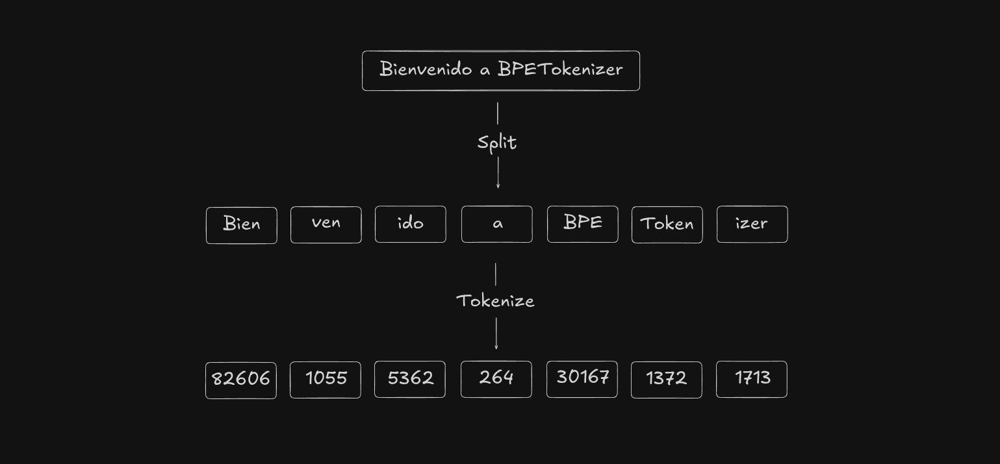

 

# **BPETokenizer**
Una implementación didáctica en Python del algoritmo Byte-Pair Encoding (BPE) (Sennrich et al., 2016).

Este mini proyecto es la implementación del algoritmo Byte-Pair Encoding (BPE) para tokenizar texto como lo hacen los LLMs. Para una inmersión completa y práctica en el tema, se incluye el notebook interactivo [`explicación_bpe.ipynb`](./explicación_bpe.ipynb) [](https://colab.research.google.com/github/ErikSarriegui/BPETokenizer/blob/main//explicación_bpe.ipynb), que sirve como guía paso a paso para entender cada componente del algoritmo. Es el punto de partida ideal si tu objetivo es aprender.

## **Índice**
* Propósito y Advertencia
* Instalación
* ¿Cómo Usarlo?
    1. Preparar el Corpus
    2. Entrenar el Tokenizador
    3. Guardar y Cargar
    4. Tokenizar y De-tokenizar Texto
* ¿Cómo Funciona el Algoritmo BPE?
* Licencia
* Agradecimientos
* Bibliografía


## ⚠️**Propósito y Advertencia**⚠️
Este proyecto es una implementación sencilla del algoritmo BPE en Python que, pese a permitir el entrenamiento e inferencia de tokenizadores, no debería utilizarse en entornos de producción. Este proyecto tiene como objetivo comprender el algoritmo de Byte-Pair Encoding y el funcionamiento de los tokenizadores, si lo que buscas es utilizar tokenizadores de manera eficiente puedes ver los siguientes proyectos:
* [`tiktoken`](https://github.com/openai/tiktoken) de OpenAI.
* [`sentencepiece`](https://github.com/google/sentencepiece) de Google.
* [`tokenizers`](https://github.com/huggingface/tokenizers) de Hugging Face.

## **Instalación**
El proyecto puede instalarse mediante `pip` con:
```bash
pip install git+https://github.com/ErikSarriegui/BPETokenizer 
```
Una vez instalado en el sistema ya está listo para utilizarse.

## **¿Cómo usarlo?**
Para una guía de inicio rápido y un ejemplo práctico, puedes ejecutar el notebook `quickstart.ipynb` directamente en Google Colab:
[](https://colab.research.google.com/github/ErikSarriegui/BPETokenizer/blob/main/quickstart.ipynb)

### 1. Preparar el Corpus
Primero necesitas preparar el texto que usarás para entrenar el tokenizador:

```python
texto_entrenamiento = "Tu texto de entrenamiento aquí..."
```

### 2. Entrenar el Tokenizador
Para entrenar un nuevo tokenizador:

```python
from BPETokenizer import BPETrainer

# Crear el entrenador
trainer = BPETrainer()

# Entrenar el tokenizador
# vocab_size: número total de tokens (incluyendo bytes base)
# verbose: muestra el progreso del entrenamiento
trainer.train(
    text = texto_entrenamiento,
    vocab_size = 1000,  # Por ejemplo, para 744 fusiones (1000-256)
    verbose = True
)
```

### 3. Guardar y Cargar
Para guardar el tokenizador entrenado:

```python
# Guardar el tokenizador
trainer.save("ruta/para/guardar")
```

Para cargar un tokenizador previamente entrenado:

```python
from BPETokenizer import BPETokenizer

# Cargar el tokenizador
tokenizer = BPETokenizer.from_dir("ruta/donde/guardaste")
```

### 4. Codificar y De-codificar Texto
Una vez cargado el tokenizador, puedes usarlo así:

```python
# Tokenizar texto
texto = "Ejemplo de texto para tokenizar"
tokens = tokenizer.encode(texto)

# De-tokenizar
texto_reconstruido = tokenizer.decode(tokens)
```

El tokenizador utiliza por defecto el patrón de regex de GPT-2 (Radford et al., 2019), pero puedes especificar un patrón personalizado tanto en el entrenamiento como en la carga:

```python
# Usar patrón personalizado
trainer = BPETrainer(pattern="tu_patron_regex")
# o
tokenizer = BPETokenizer.from_dir("ruta", pattern="tu_patron_regex")
```
## **¿Cómo Funciona el Algoritmo BPE?**
Para entender cómo funciona el tokenizador, es crucial descomponer el proceso en varias capas, desde cómo se representa el texto en un ordenador hasta el algoritmo de fusión de pares de bytes. En el notebook `explicacion_bpe.ipynb` de este repositorio encontrarás una guía interactiva que demuestra cada uno de estos pasos con código. Pero antes de nada, respondamos a una pregunta fundamental: Qué es un tokenizador? y ¿Por qué necesitamos uno?

### 1. ¿Qué es un Tokenizador y por qué lo necesitamos?
Un modelo de lenguaje es, en esencia, una compleja máquina matemática. No puede "leer" la palabra `hola` de la misma forma que nosotros, las máquinas solo pueden realizar operaciones matemáticas y no se puede operar con letras, es decir, no se puede, por ejemplo, multiplicar una `h` por una `o`. Por lo tanto, el primer paso en cualquier tarea de Procesamiento del Lenguaje Natural (NLP) es convertir el texto en una secuencia de números que el modelo pueda procesar.

Este proceso de conversión se llama **tokenización**, y el encargado de hacerlo es el **tokenizador**.

**¿Por qué no usar un método simple?**
Podríamos pensar en soluciones sencillas, como asignar un número único a cada palabra del diccionario. Sin embargo, esto presenta varios problemas:
*   **Vocabulario Gigante:** El número de palabras en un idioma es enorme (¡y no para de crecer!), lo que haría que el modelo fuera inmanejable.
*   **Palabras Desconocidas (Out-of-Vocabulary):** ¿Qué hace el modelo cuando se encuentra una palabra que no vio durante el entrenamiento, como un neologismo, un error tipográfico (`"ejemlpo"`) o un nombre propio raro?
*   **Relaciones entre Palabras:** Las palabras como "correr", "corriendo" o "corredor" comparten una raíz común (`corr-`). Un sistema simple que asigna un ID diferente a cada una pierde esta valiosa información morfológica.

Aquí es donde brillan los algoritmos de tokenización por sub-palabras como **BPE**. En lugar de tratar las palabras como unidades indivisibles, BPE las descompone en "piezas" más pequeñas y frecuentes. De esta manera, puede:
1.  **Manejar un vocabulario de tamaño fijo y razonable.**
2.  **Representar cualquier palabra**, incluso las desconocidas, combinando las sub-palabras que sí conoce. Por ejemplo, podría representar "tokenizando" como `["token", "izando"]`.
3.  **Capturar información morfológica**, ya que las raíces y sufijos comunes se convierten en tokens.

Ahora que entendemos *por qué* es necesario tokenizar, veamos *cómo* el algoritmo BPE lo consigue, empezando por cómo se representa el texto en un ordenador.

### 2. Strings en Python: Secuencias de Puntos de Código Unicode
Cuando trabajamos con texto en Python, como `"Hola 👋"`, no estamos manejando directamente los bytes. Un `str` de Python es una secuencia de **puntos de código Unicode** (The Unicode Consortium). Unicode es un estándar que asigna un número único (un "punto de código") a casi cualquier carácter, símbolo o emoji imaginable.

Podemos ver estos números usando la función `ord()`:
*   `ord('H')` devuelve `72`.
*   `ord('o')` devuelve `111`.
*   `ord('👋')` devuelve `128075`.

La función `chr()` hace lo contrario: `chr(128075)` nos devuelve `'👋'`. Esto nos permite representar una inmensa variedad de lenguajes y símbolos de manera abstracta. Sin embargo, para almacenar o transmitir este texto, necesitamos una forma de codificar estos números en bytes.

### 3. De Unicode a Bytes: La Codificación UTF-8
Aquí es donde entra en juego la codificación **UTF-8**. Es un formato de codificación de longitud variable que traduce los puntos de código Unicode a una secuencia de bytes. Su principal ventaja es que es muy eficiente:
*   Los caracteres del alfabeto inglés básico (ASCII) se codifican en **1 byte**.
*   Caracteres latinos con acentos (como 'á' o 'ü') usan **2 bytes**.
*   Otros caracteres comunes (como el símbolo del Euro '€') usan **3 bytes**.
*   Los emojis y símbolos más raros pueden usar hasta **4 bytes**.

En Python, podemos convertir un string a su representación en bytes UTF-8 con `.encode("utf8")`:
```python
texto = "Hola 👋"
bytes_utf8 = texto.encode("utf8")
# >> b'Hola \xf0\x9f\x91\x8b'
```

Como vemos, "Hola " ocupa 5 bytes, y el emoji "👋" se ha convertido en la secuencia de 4 bytes `\xf0\x9f\x91\x8b`.
La clave del BPE moderno es que opera directamente sobre esta secuencia de bytes UTF-8. Esto es fundamental, ya que garantiza que el tokenizador nunca se encontrará con un carácter "desconocido". Cualquier texto, en cualquier idioma, puede ser descompuesto en una secuencia de bytes. El vocabulario base del algoritmo son, por tanto, los 256 valores de byte posibles (de 0 a 255).

### 4. El Algoritmo Byte-Pair Encoding (BPE)
Una vez que tenemos nuestro corpus de texto convertido en secuencias de bytes, comienza el entrenamiento del BPE. El objetivo es encontrar una forma de representar el texto de manera más compacta.

El algoritmo es un bucle iterativo muy simple:
*   **Inicialización**: El vocabulario inicial contiene 256 tokens, uno por cada valor de byte posible (0-255).
*   **Búsqueda**: Se analiza todo el texto de entrenamiento para encontrar el **par de tokens adyacentes más frecuente**. Al principio, estos tokens serán bytes individuales.
*   **Fusión (Merge)**: Se crea un **nuevo token** para representar a este par. El ID de este nuevo token será el siguiente número disponible (256, 257, 258, etc.). Esta regla de fusión (ej: `(101, 108) -> 256`) se almacena.
*   **Reemplazo**: Se vuelve a recorrer todo el texto y se reemplazan todas las ocurrencias del par más frecuente por el nuevo token recién creado.
*   **Repetir**: Se repiten los pasos un número determinado de veces. Este número lo definimos con `vocab_size`. Si queremos un vocabulario de 1000 tokens, realizaremos `1000 - 256 = 744` fusiones.

El resultado del entrenamiento es una **lista de fusiones ordenadas por prioridad**. Para tokenizar un texto nuevo, se aplican estas mismas fusiones en el mismo orden. Para de-tokenizar, simplemente se deshace el proceso, convirtiendo cada token en su secuencia de bytes correspondiente.

### 5. La Importancia de los Patrones Regex (Pre-tokenización)
Si aplicamos BPE directamente sobre un texto, el algoritmo podría fusionar bytes que cruzan los límites de las palabras (por ejemplo, la "e" final de "coche" y la "a" inicial de "azul" en "coche azul"). Esto es, por lo general, semánticamente indeseable.

Para evitarlo, los tokenizadores modernos como el de GPT-2 realizan una **pre-tokenización** usando expresiones regulares (regex). Antes de aplicar BPE, el texto se divide en trozos más pequeños. El patrón regex de GPT-2, por ejemplo, está diseñado para separar palabras, números, puntución y súmbolos y contracciones comunes.

El algoritmo BPE se ejecuta de forma independiente **dentro de cada uno de estos trozos**. Esto asegura que las fusiones se mantengan dentro de los límites de las palabras y la puntuación, generando tokens mucho más intuitivos y útiles para el modelo de lenguaje, como `" token"` (con un espacio al principio) o `"izar"`.

Puedes ver cómo interactúan el regex y BPE en la web de [tiktokenizer](https://tiktokenizer.vercel.app/).

### 6. Tokens Especiales
Finalmente, a menudo necesitamos tokens que no se derivan del texto, sino que sirven como instrucciones para el modelo. Ejemplos comunes son:
*   `<|endoftext|>`: Indica el final de un documento.
*   `<|im_start|>` y `<|im_end|>`: Usados en modelos de chat para delimitar los mensajes.
*   `<|pad|>`: Un token de relleno para que todas las secuencias de un batch tengan la misma longitud.

Estos tokens se añaden al vocabulario **después del entrenamiento BPE**, asignándoles IDs de token que no entren en conflicto con los existentes. Durante la tokenización, se tratan como palabras completas y no se descomponen.

## **Licencia**
Este proyecto se distribuye bajo los términos de la **Licencia MIT**.

Esto significa que tienes una gran libertad para hacer lo que quieras con el código, siempre y cuando incluyas el aviso de derechos de autor y el texto de la licencia original en cualquier copia sustancial del software. En resumen, eres libre de:

*   **Usar** el software para cualquier propósito (comercial, personal, educativo, etc.).
*   **Modificar** el código para adaptarlo a tus necesidades.
*   **Distribuir** copias del código.
*   **Sublicenciar** el software, es decir, incorporarlo en tus propios proyectos, incluso si son de código cerrado.

Para leer el texto legal completo, consulta el archivo `LICENSE` que se encuentra en la raíz de este repositorio.

## **Agradecimientos**

Quiero ofrecer un agradecimiento especial y una atribución directa a **Andrej Karpathy**.

Es fundamental ser completamente transparente: este proyecto no está simplemente *inspirado* por su trabajo; es, en gran medida, una **adaptación y refactorización del código** que él desarrolla en vivo en su extraordinario vídeo sobre tokenizadores (Karpathy, 2023). La lógica central del algoritmo BPE y la estructura del entrenador (`BPETrainer`) siguen muy de cerca su implementación.

El propósito sirve como un ejercicio personal para desgranar e interiorizar cada línea y concepto que Karpathy explica con una claridad magistral. Por esto mismo, si realmente quieres entender cómo funciona un tokenizador desde los cimientos, ver el vídeo original de Karpathy no es solo una recomendación, es la fuente primaria y la clase magistral de la que bebe todo este proyecto.

## **Bibliografía**
*   **Sennrich, R., Haddow, B., & Birch, A. (2016). *Neural Machine Translation of Rare Words with Subword Units*.** Artículo seminal que propuso el uso de BPE en el contexto de la Traducción Automática Neuronal, sentando las bases para su uso en los LLMs modernos. [Enlace al paper](https://arxiv.org/abs/1508.07909).

*   **Radford, A., Wu, J., Child, R., Luan, D., Amodei, D., & Sutskever, I. (2019). *Language Models are Unsupervised Multitask Learners*.** El paper de GPT-2, cuya implementación del tokenizador BPE, especialmente su patrón de pre-tokenización mediante regex, es una referencia directa para este proyecto. [Enlace al paper](https://cdn.openai.com/better-language-models/language_models_are_unsupervised_multitask_learners.pdf).

*   **Karpathy, A. (2023). *Let's build the GPT Tokenizer*.** Vídeo-tutorial y clase magistral que sirve como fuente primaria para la implementación práctica y la estructura del código de este repositorio. [Enlace al vídeo](https://www.youtube.com/watch?v=zduSFxRajkE).

*   **The Unicode Consortium. *The Unicode Standard*.** Estándar que define los puntos de código y la codificación (como UTF-8) sobre los que se construye el procesamiento de texto moderno y la capa base de este tokenizador. [Sitio web oficial](https://home.unicode.org/).